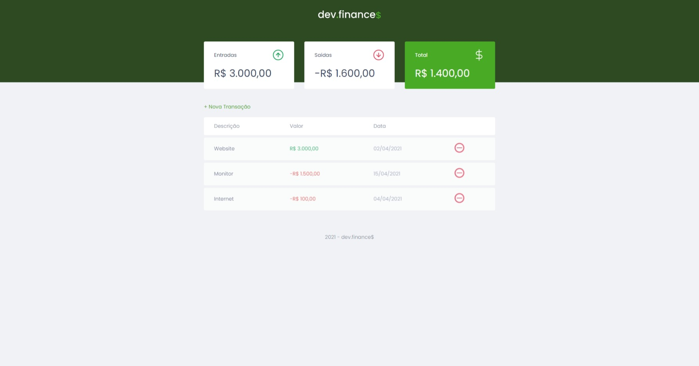

<h1 align="center">
  
</h1>

<p align="center">
  <a href="#-tecnologias">Tecnologias</a>&nbsp;&nbsp;&nbsp;|&nbsp;&nbsp;&nbsp;
  <a href="#-projeto">Projeto</a>&nbsp;&nbsp;&nbsp;|&nbsp;&nbsp;&nbsp;
  <a href="#memo-licença">Licença</a>
</p>

<p align="center">
 

  
</p>

<br>

<p align="center">
  
</p>

### Rodando o dev-finance

```bash
# Clone este repositório
$ git clone https://github.com/rafaelmyb/dev-finance.git

# Acesse a pasta do projeto no terminal/cmd
$ cd dev-finance

# Execute o arquivo index.html com o Live-Server
```

Ou baixe os arquivos e comece abrindo-os em algum editor como o vscode por exemplo e executando com o Live-Server o index.html 

## 🚀 Tecnologias

Esse projeto foi desenvolvido com as seguintes tecnologias:

- HTML
- CSS
- JavaScript

## 💻 Projeto

O dev.finance$ é uma aplicação de registro de finanças, no qual é possível cadastrar entradas, saídas e obter o saldo ou débito, juntamente com a soma do valor das entradas e saídas. O programa mostra também uma pequena descrição sobre essas entradas e saídas, contendo nome, valor e data. 💰

## :memo: Licença

Esse projeto está sob a licença MIT. Veja o arquivo [LICENSE](.github/LICENSE.md) para mais detalhes.

---

Feito com ♥ by Rocketseat :wave: [Participe da nossa comunidade!](https://discordapp.com/invite/gCRAFhc)
